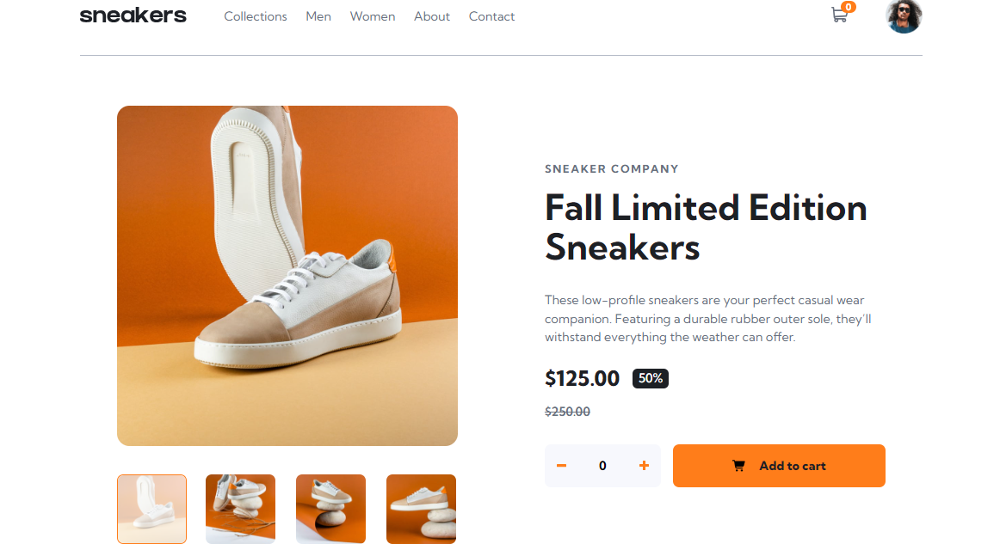
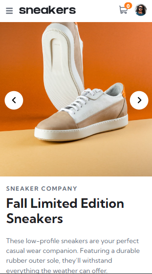

# E-commerce Product Page

This is a solution to the E-commerce Product Page challenge on Frontend Mentor. It is a responsive product page that allows users to view product details, interact with images, and manage items in a cart.

---

## Table of Contents

- [Overview](#overview)
  - [The Challenge](#the-challenge)
  - [Screenshot](#screenshot)
  - [Links](#links)
- [My Process](#my-process)
  - [Built With](#built-with)
  - [What I Learned](#what-i-learned)
  - [Continued Development](#continued-development)
- [Author](#author)

---

## Overview

### The Challenge

Users should be able to:

- View the product page on different screen sizes
- See hover and interactive states for elements
- Open a lightbox gallery
- Switch product images using thumbnails
- Add items to the cart
- Increase or decrease product quantity
- View cart details and remove items

---

### Screenshot

| Desktop | Mobile |
|---------|--------|
|  |  |

---

### Links

- Repository:  
  https://github.com/IrfanAnsari21/ecommerce-product-page.git  

- Live Site:  
  https://irfanansari21.github.io/ecommerce-product-page/

---

## My Process

### Built With

- Semantic HTML5
- CSS (Flexbox / Responsive Design)
- JavaScript (DOM Manipulation & Cart Logic)

---

### 🧠 What I Learned

- Handling complex UI interactions with JavaScript
- Managing cart state and updating UI dynamically
- Implementing image gallery and thumbnails
- Writing cleaner and modular JavaScript code
- Improving responsiveness and layout structure

---

### 🚀 Continued Development

- Add backend/cart persistence
- Improve accessibility (keyboard navigation, ARIA)
- Enhance animations and transitions
- Optimize performance and code structure

---

## 👨‍💻 Author

- GitHub:  [@IrfanAnsari21](https://github.com/IrfanAnsari21)

- Frontend Mentor:  [@IrfanAnsari21](https://www.frontendmentor.io/profile/IrfanAnsari21)

---

## ⭐ Acknowledgments

Thanks to **Frontend Mentor** for providing this challenge to improve real-world frontend skills.